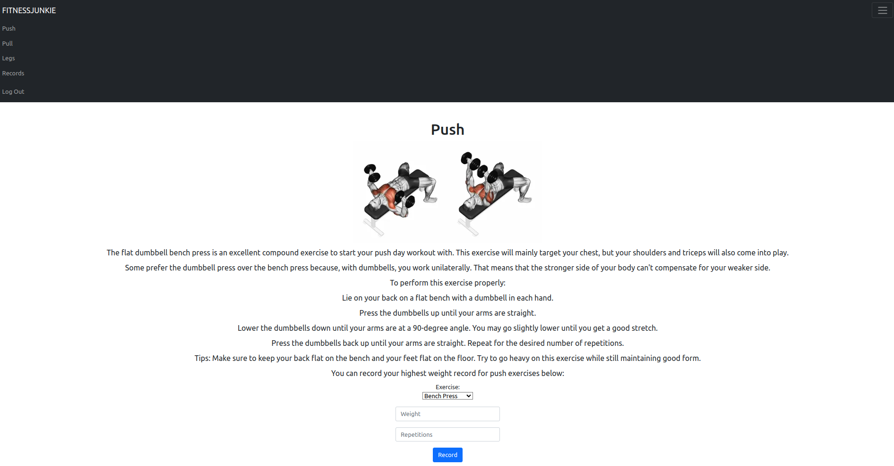

# FITNESSJUNKIE

#### Description:

FitnessJunkie

The purpose of the web application is to give users the ability to create an account, log in, and access information about various exercises. Users can also track and record their heaviest lift for each exercise to monitor their progress. The app aims to be a resource for people looking to improve their physical fitness by providing exercise guides and information. The app also includes a records page where users can log their weights and repetitions for each exercise, along with a date stamp, to see their progress in each muscle group.

The template folder contains several HTML files, including pages for login, registration, records, push, pull, and legs. These files use both Jinja and HTML code. The layout page includes the main HTML code, including the navbar which will be displayed on all pages using Jinja. The records HTML file uses a Jinja for loop to display the data from the "records" table, allowing users to view the information they have entered into the web application.

In the app.py file, it is written in Python and is using the Flask web framework to build a web application. The code configures the application and sets up routes, which are URLs that the application can handle, and functions to execute when those routes are accessed.The @app.route decorators above the functions specify the URL that the function should be associated with. For example, the index function will execute when the user accesses the root URL of the application (/).The login and logout functions handle the user login and logout process, respectively. The push, pull, and legs functions allow users to enter exercise information and record it in the database. The register function allows new users to create an account, and the apology function is used to display custom error messages.

The @app.after_request decorator specifies a function that should be executed after every request made to the application. In this case, the function sets the cache control headers to prevent caching of responses.

The @login_required decorator is a custom decorator that checks if the user is logged in before allowing access to certain routes. If the user is not logged in, they will be redirected to the login page.

If a user makes a mistake or does not provide a password or username, the apology function will redirect the user to a custom meme with the HTML error code and what went wrong allowing them to fix the problem. The majority of the styling for the application has been implemented using the Bootstrap framework.



#### Technologies Used:

- Python: This application is written in Python, so you will need to have Python 3 installed on your computer.

- Flask: This application uses the Flask web framework to build the web application. You will need to have Flask installed on your computer in order to run the application.

- Jinja: This application uses the Jinja templating language to render HTML templates with dynamic content.

- HTML/CSS/JavaScript: This application uses HTML, CSS, and JavaScript to create the user interface and to provide interactivity.

- Bootstrap: This application uses the Bootstrap framework to style the user interface and to make the application responsive.

- SQL: This application uses SQL to interact with the database and store and retrieve data.

- SQLite: This application uses SQLite as the database management system to store the user data.

#### Installation:

To run a Flask application, you can follow these steps:

1. Make sure you have Python and Flask installed on your computer.

2. Navigate to the directory containing the Flask application using the terminal or command prompt.

3. Install requirements

   ```
   pip install cs50
   pip install flask
   pip install flask-session
   ```

4. Run the application using the following command:

   ```
   flask run
   ```

   Once the application is running, you can access it by opening a web browser and navigating to http://localhost:5000 (or a different URL if specified in your Flask application).
   Note that you may need to register a new account before you can log in and access the full functionality of the application.
